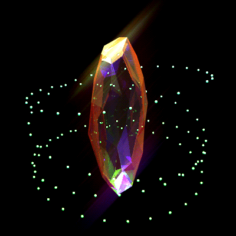

  

<h1 align="center">Joory</h1>

  <b>Computer Science Student & Developer</b>

<h2 align="center">🚀 About Me</h2>

<table>
  <tr>
    <td width="60%">
      

        I’m <b>Joory</b>, a Computer Science student passionate about technology and software development. I enjoy turning ideas into real projects and exploring different areas of tech to discover where I can create the most impact.
      

      

        I’m particularly interested in web and application development, and I believe the best way to learn is by building, experimenting, and learning from every experience.
      

      

        I’m always looking to grow my skills, build meaningful projects, and turn the ideas in my head into something real that people can use.
      

    </td>
    <td width="40%" align="center">
      
    </td>
  </tr>
</table>

<h2 align="center">🤝 Connect</h2>

  <a href="https://www.linkedin.com/in/joory-almohaimeed?utm_source=share_via&utm_content=profile&utm_medium=member_ios" target="_blank">
    <img src="https://skillicons
